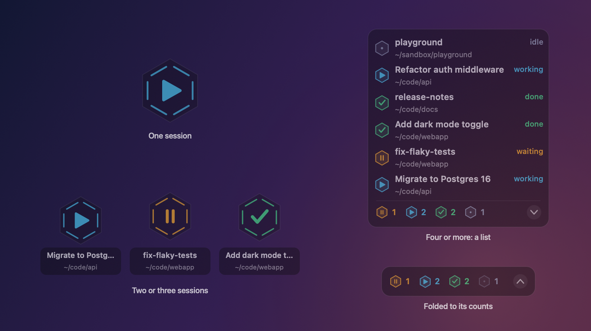
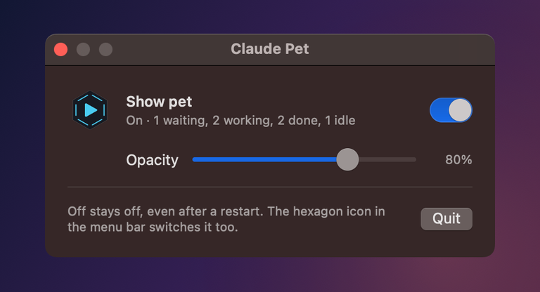

# Claude Pet

A small, silent desktop pet for macOS that shows what your Claude Code sessions are doing,
so you can glance over instead of tabbing back to the terminal.



Every session gets a hexagon whose glyph and color say what it's doing:

| | State | Meaning |
|---|---|---|
| ▶ cyan | **working** | Claude is on a turn |
| ⏸ amber | **waiting** | blocked on a permission prompt or waiting for input |
| ✓ green | **done** | the turn finished; it stays here until your next prompt |
| • slate | **idle** | nothing running |

## Features

- **Floats above everything**, on every Space and beside full-screen apps, without ever taking keyboard focus.
- **One to three sessions show as big pets**; four or more become a compact list with each session's
  name and directory, up to 16 rows. Session names come from `/rename`, or else the title Claude gave the session.
- **Click a row to bring that session's terminal forward.** Inside tmux, it switches to the exact pane and
  raises the Terminal tab attached to it, or opens one if no tab is.
- **Fold the list** down to a bar of counts with the chevron.
- **When a turn finishes**, its row washes green and its mark bounces once; then everything holds still.
- **Menu bar icon** to show or hide the pet. Off stays off across restarts, and the app sits idle with no timers.
- **Settings window** with an on/off switch and an opacity slider (80% by default).
- **Silent**: no sounds, no notifications, no Dock icon.
- **One Swift file**: no Xcode project and no dependencies.



## Requirements

- macOS 12 or later (developed on macOS 13)
- Xcode Command Line Tools, for `swiftc`: `xcode-select --install`
- Claude Code

## Install

```sh
git clone https://github.com/JinyuJinyuJinyu/claude-pet.git
cd claude-pet
./install.sh
```

`install.sh` does four things:

1. Builds `claude-pet.swift` into `~/Applications/ClaudePet.app`.
2. Copies the hook script to `~/.claude/hooks/claude-pet.sh`.
3. Adds the hooks to `~/.claude/settings.json`. It merges with your existing settings and backs the file up first.
4. Starts the pet.

Restart any Claude Code sessions that were already running so they pick up the hooks.

Run it again after pulling changes. It replaces the app and keeps your preferences. Options:

| Option | Effect |
|---|---|
| `--no-hooks` | leave `~/.claude/settings.json` alone (add the hooks yourself; see below) |
| `--no-launch` | install without starting the pet |

To start the pet at login, add `~/Applications/ClaudePet.app` under
**System Settings → General → Login Items**.

## Using it

| To | Do this |
|---|---|
| Move the pet | Drag it anywhere. It remembers the spot and grows up and left from its bottom-right corner. |
| Go to a session | Click its row (or its big pet). |
| Fold or unfold the list | Click the chevron on the count bar, or right-click → Fold List. |
| Hide or show the pet | Use the hexagon in the menu bar, or right-click → Hide Pet. |
| Change opacity | Menu bar → Settings… |
| Name a session | Run `/rename my-name` in Claude Code. The pet picks the name up within seconds. |

**The first time you click a session**, macOS asks whether Claude Pet may control Terminal. Allow it so the
pet can bring the right tab forward. You can change this later in **System Settings → Privacy & Security → Automation**.

## How it works

```
Claude Code ──hooks──▶ ~/.claude/claude-pet.d/<session id> ──read 5×/s──▶ ClaudePet.app
```

Two pieces, connected by a folder:

1. **Hooks.** `hooks/claude-pet.sh` runs on Claude Code events and writes one small file per session:
   `working <pid> <project>`.

   | Event | State written |
   |---|---|
   | `UserPromptSubmit` | `working` |
   | `PreToolUse` | `working` (back to work after a permission prompt) |
   | `Stop` | `done` |
   | `Notification` | `waiting` (a permission prompt, or idle input) |
   | `SessionEnd` | removes the file |

   A `waiting` never overwrites `done`: Claude Code also sends its idle notification after a turn ends.

2. **The app.** It polls the folder five times a second, checking modification times first so unchanged files
   aren't re-read. Sessions whose process has exited drop off the pet. The exception is when nothing else is
   running: a finished one stays so you can still see it. Leftover files are cleaned up after a day.

To add the hooks by hand, copy `hooks/claude-pet.sh` to `~/.claude/hooks/` and merge this into
`~/.claude/settings.json`:

```json
{
  "hooks": {
    "UserPromptSubmit": [{ "hooks": [{ "type": "command", "command": "\"$HOME/.claude/hooks/claude-pet.sh\" working" }] }],
    "PreToolUse":       [{ "hooks": [{ "type": "command", "command": "\"$HOME/.claude/hooks/claude-pet.sh\" working" }] }],
    "Stop":             [{ "hooks": [{ "type": "command", "command": "\"$HOME/.claude/hooks/claude-pet.sh\" done" }] }],
    "Notification":     [{ "hooks": [{ "type": "command", "command": "\"$HOME/.claude/hooks/claude-pet.sh\" waiting" }] }],
    "SessionEnd":       [{ "hooks": [{ "type": "command", "command": "\"$HOME/.claude/hooks/claude-pet.sh\" end" }] }]
  }
}
```

### Privacy

Everything stays on your Mac. The app makes no network requests. To show session names it reads each
transcript in `~/.claude/projects/`, but only two parts:

- the last 256 KB, for the `/rename` name or the generated title
- the first 256 KB, once, for the directory the session started in

It never reads your conversations otherwise.

### Terminal support

Clicking a session works best in **Terminal.app**, with or without **tmux**: the pet finds the exact tab, or
the exact tmux pane and the tab attached to it. For other terminals (iTerm2, VS Code, …) it brings the app
forward but can't pick the tab.

## Uninstall

```sh
./uninstall.sh
```

This removes the app, the hook script, the hooks in `~/.claude/settings.json` (after a backup), the state files
and the preferences. Your other Claude Code settings are left as they are.

## Troubleshooting

- **The pet doesn't change state.** Restart your Claude Code sessions after installing. Then check that
  `~/.claude/claude-pet.d/` gets a file when you send a prompt.
- **Clicking a session does nothing.** Allow Claude Pet to control Terminal under
  **System Settings → Privacy & Security → Automation**.
- **The pet is gone.** Use the hexagon icon in the menu bar → Show Pet. If the icon is gone too, the app isn't
  running: open Claude Pet from Spotlight.

## Building by hand

```sh
swiftc -O claude-pet.swift -o claude-pet     # the app, as a bare binary
./claude-pet &                               # run it without a bundle
swiftc -O make-icon.swift -o make-icon && ./make-icon ClaudePet.icns
```

## License

[MIT](LICENSE)

Claude Pet is an independent community project. It is not affiliated with or endorsed by Anthropic.
